# kage 🥷

[](https://github.com/kid7st/kage/actions/workflows/ci.yml)
[](https://www.npmjs.com/package/pi-kage)
[](./LICENSE)

> **影分身の術** — cast the **Shadow Clone Jutsu** on your git repo.

<p align="center"></p>

`kage` copies your repo into an isolated sibling folder, drops you straight into a **fresh**
[pi](https://github.com/earendil-works) session to work in parallel, and when you're done merges the
clone's new sessions back into the original and dispels the clone.

```bash
npm install -g pi-kage
cd my-app
kage                 # 🥷 clone → ../my-app--kage-<ts>, open a fresh pi (origin history resumable)
#   ...work in the clone: commit, push, open a PR, quit pi...
kage finish          # 💨 merge the clone's new sessions back, delete the clone
```

---

## The problem

Running **multiple agent sessions on the same repo at once** is a mess: they edit the same files,
fight over the working tree, and collide on branches. You end up babysitting merge conflicts
instead of shipping.

## The idea

A shadow clone is a **full, independent copy** of the repo — like a second engineer on a second
machine. Each parallel session gets its own working tree, its own branch, its own commits and PR.
Code merges the normal way: on GitHub. No local collisions, ever.

And like a real Naruto shadow clone, it **carries your memory out** (the origin's 5 most recent pi
sessions are copied into the clone, so you can `resume` them there) and **returns it on dispel** (the clone's
*new* sessions are merged back into the original when you `finish`). The clone always opens a **fresh**
session — kage never replays your old turns or fakes a "resumed" conversation.

Why a full folder copy instead of `git worktree`? A worktree shares one `.git`, which means you
can't check out the same branch twice, you share stash/refs, and you get a *fresh* checkout with no
`node_modules` / `.env` / build cache. A real copy avoids all of that. On macOS APFS the copy is a
`cp -c` clonefile (copy-on-write): near-instant and space-free until files diverge.

## Install

```bash
# npm
npm install -g pi-kage     # then use `kage` anywhere
npx pi-kage                # or run without installing

# or install script (no npm needed — kage is a single, zero-dependency Node script)
curl -fsSL https://raw.githubusercontent.com/kid7st/kage/main/install.sh | sh
```

The install script drops the single `kage` file into `~/.local/bin` (override with `KAGE_BIN_DIR`,
pin a version with `KAGE_VERSION`). kage has **no dependencies** — it only needs Node, git, and pi.

From source:

```bash
git clone https://github.com/kid7st/kage
cd kage && npm link
```

Requires **git**, [**pi**](https://github.com/earendil-works), and **Node ≥ 18** on your `PATH`.

## Lifecycle

```
  origin repo (you)                         shadow clone (independent copy)
  ─────────────────                         ──────────────────────────────
  $ kage --name fix-login   ─copy + history─►  ../my-app--fix-login
                                              $ pi      (fresh session; origin history resumable)
                                                · git switch -c fix-login
                                                · edit / commit / push / open PR
                                                · quit pi
  $ kage finish fix-login   ◄─new sessions──  (the clone's .jsonl, copied back)
        · safety check (committed? pushed?)
        · merge the clone's new sessions into ~/.pi
        · delete the clone folder
  code arrives via the merged GitHub PR ✓
```

## Usage

```bash
cd ~/code/my-app

kage                       # clone . → ../my-app--kage-<ts>, open a fresh pi (origin history resumable)
kage --name fix-login      # name the clone folder: ../my-app--fix-login
kage /path/to/other-repo   # clone a different repo (path defaults to cwd)

# back in the origin after you quit the clone's pi:
kage                       # no args inside a repo with clones -> interactive menu
kage status                # status dashboard: branch · dirty · ahead/behind · safe-to-clean
kage status --pr           # also show PR state (via gh)
kage finish fix-login      # check → merge the clone's new sessions back → delete the clone
kage finish fix-login --pr # push the branch + open a PR (via gh), then finish
kage finish --force        # skip the uncommitted/unpushed guard
kage rm old-experiment     # discard a clone without merging (refuses if it has local-only work)

# inside a clone, to retrieve a non-git file (e.g. a generated .env):
kage pull .env config/local.json
```

With no arguments inside a repo that already has clones, `kage` shows an interactive picker: create a
new clone, or select an existing one to **enter** (`pi -c`), **finish**, or **remove**. `finish` and `rm`
show the same picker when you have multiple clones and don't name one.

### Shell integration (optional)

```bash
eval "$(kage shell-init)"   # add to ~/.zshrc or ~/.bashrc
```

This wraps `kage` so that `finish`/`rm` run from inside a clone **cd you back to the origin**
automatically (a CLI can't change its parent shell's directory otherwise), and adds tab completion
for subcommands and clone names.

### Commands

| Command | Run from | What it does |
|---|---|---|
| `kage [path] [--name x]` | origin repo | Copy the repo to `../<repo>--<name>` (default `kage-<ts>`), copy the origin's 5 most recent pi sessions into the clone (resumable there, never replayed), and launch a **fresh** `pi` session. `--name` only names the folder — kage never creates a branch. With no args (and existing clones) it opens an interactive picker. |
| `kage status [--pr]` | origin repo | Status dashboard of clones: branch, dirty/clean, ahead/behind upstream, and a “safe to clean” flag. `--pr` adds PR state via `gh`. (`kage list` is a kept alias.) |
| `kage finish [name] [--force] [--push] [--pr]` | origin, inside the clone, or anywhere with a clone path | Refuse if the clone has uncommitted or unpushed work (`--force` overrides), merge the clone's **new** sessions back (copied-in origin history is skipped), then delete the clone. `--push` pushes the branch first; `--pr` pushes and opens a PR via `gh`. Auto-selects / prompts when there are several. |
| `kage rm [name] [--force]` | origin, inside the clone, or anywhere with a clone path | Discard a clone **without** merging memory. Refuses if it has local-only work unless `--force`. For abandoned experiments. `name` may be a clone name (run from the repo) or a path to the clone folder (works from anywhere). |
| `kage pull <path...>` | inside a clone | Copy specific files/dirs (even gitignored ones) back to the origin at the same relative path. |
| `kage shell-init` | shell rc | Print a shell wrapper (cd-back after `finish`/`rm`) + tab completion. Use `eval "$(kage shell-init)"`. |
| `kage --help` / `--version` | anywhere | Usage / version. |

## How it works

Four invariants keep parallel work safe and lossless:

1. **Isolation** — a clone is a full independent copy with its own `.git`.
2. **Code flows back via git, never the working tree.** With a remote you push the branch and merge a
   PR; with **no remote**, `finish` fetches the clone's branch into the origin's git as a local
   `kage/<name>-<sha>` branch (the origin's working tree is left untouched — merge it when you like). Either
   way kage never copies the clone's working tree onto the origin, which would re-create the collisions
   it avoids. `finish` still refuses to delete **uncommitted** work (it can't be preserved by a fetch).
3. **Memory flows through `~/.pi`.** On create, the origin's session `.jsonl` files are copied into the
   clone (the 5 most recent, by mtime) — so `pi`'s resume picker inside the clone surfaces them if you
   want it, but the clone itself opens a **fresh** session (kage never replays turns or fakes a resumed
   conversation). On `finish`, sessions the clone created are copied back whole; an unchanged copied-in
   session adds nothing; and a copied-in session you *resumed and added to* comes back as a **new,
   self-contained session** — so the origin's original session (and the leaf pi would resume) is never
   mutated, and your added turns aren't lost.
4. **The origin is read-only to kage** — it only copies out and writes session memory; it never
   touches the origin's working tree, even while another session is live there.

## Notes & caveats

- The copy is a snapshot of the origin's **current** state, **including uncommitted changes**.
- kage **doesn't create a branch** — the clone stays on the origin's current branch, and kage stays out
  of git flow entirely. Decide your own branching/PR workflow inside the clone (instruct the agent via
  your `AGENTS.md` / project conventions).
- The clone opens a **fresh** pi session. The origin's 5 most recent sessions are copied in and are **resumable** via
  pi's resume picker. Real work belongs in the clone's own fresh session, but if you do resume a copied
  origin session and add turns, on `finish` that continuation is written back as a **separate** session
  (the origin's original session is left untouched), so nothing is lost and no active conversation is hijacked.
- **Upgrading from an older kage:** clones created before the copy-in/fresh-session redesign carry a
  fabricated *seed* session in their `.kage.json` (`seedFile`/`seedLeafId`). `finish` no longer special-
  cases those, so finishing such a clone would copy the replayed seed context back into the origin. For
  any clone created by an older kage, prefer `kage rm` (the code is already on its branch / PR) instead
  of `kage finish`.
- **No remote?** `finish` still works losslessly: committed work that isn't on a remote is fetched into
  the origin as a local `kage/<name>-<sha>` branch (the exact name is printed; `git merge` it to
  integrate). The short sha keeps the ref unique, so reusing a clone name never collides. With a remote
  configured, `finish` keeps nudging you to push first (so PR-flow mistakes surface) unless you
  `--push`/`--pr` or `--force`.
- **Submodules**: a submodule's `.git` pointer is an absolute path and breaks on copy — run
  `git submodule update --init` in the clone.
- Non-APFS / non-reflink filesystems fall back to a full (heavier) copy.
- Session storage is assumed at `~/.pi/agent/sessions`; override with `KAGE_SESSIONS_DIR`.

## Development

```bash
npm run lint     # syntax check
npm test         # node:test smoke tests (temp repos, no network)
```

Releases publish automatically: bump `version` in `package.json`, then

```bash
git tag vX.Y.Z && git push origin main vX.Y.Z
```

CI runs lint + tests and `npm publish --provenance` on any `v*` tag.

## License

[MIT](./LICENSE)
